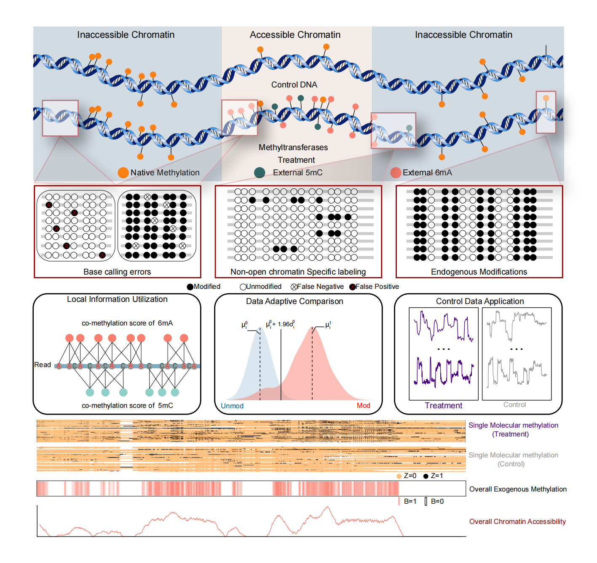

# MAGNIFIER
- Methyltransferase accessible genome region finder (MAGNIFIER) is a bioinformatic tools designed for nanopore-based chromatin methylatransferase accessible chromatin detection.

## Dependencies ##
- Python version >= 3.7
- numpy version >= 1.19.2
- pandas version >= 1.2.1
- pysam version >= 0.15.3
- megalodon version >= 2.2.9
- pybedtools version >= 0.8.1
- scipy version >= 1.6.0

## Installation instructions

### Installing the latest code from github (recommended)

You can download and compile the latest code from github as follows:

```
git clone https://github.com/Goatofmountain/MAGNIFIER.git
```

## Usage ##
### Example Usage 
#### Data prepare 
- We recommand a megalodon methylation base calling pipeline for Case and Control sample before MAGNIFIER calculation
##### For CG and A motifs
```
megalodon <fast5 file dir> --outputs mappings mod_mappings mods --reference <Human reference> --devices 0 1 2 3 --processes 40 --guppy-server-path <Path to guppy_basecall_server> --guppy-params -d <basecallmodels Dir> --guppy-config res_dna_r941_min_modbases-all-context_v001.cfg --overwrite --mod-min-prob 0 --output-directory ./megalodon_CG_A --mod-motif Z CG 0 --mod-motif Y A 0
```
##### For GC motif
```
megalodon <fast5 file dir> --outputs mappings mod_mappings mods --reference <Human reference> --devices 0 1 2 3 --processes 40 --guppy-server-path <Path to guppy_basecall_server> --guppy-params -d <basecallmodels Dir> --guppy-config res_dna_r941_min_modbases-all-context_v001.cfg --overwrite --mod-min-prob 0 --output-directory ./megalodon_GC --mod-motif Z GC 1
```
- Then using our main script to calculate the chromatin accessibility:
```
python MAGNIFIER.py -c config.config
```
- All parameter should be written into the configure file (config.config). The example configure file could be found in this Repostories with path: ./example/ExampleTXT.config

- Please firstly run the following example program to check whether all package is ready to work. 
```
cd ./example
python MAGNIFIER_Example.py -c ExampleTXT.config
```

